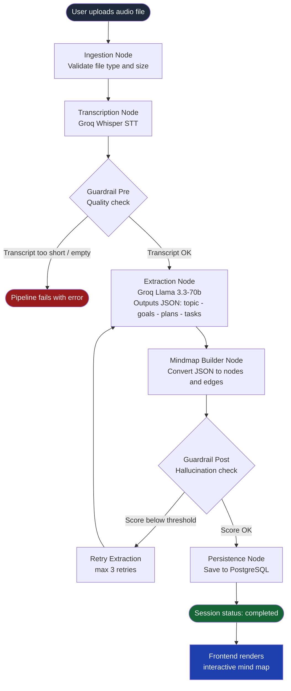
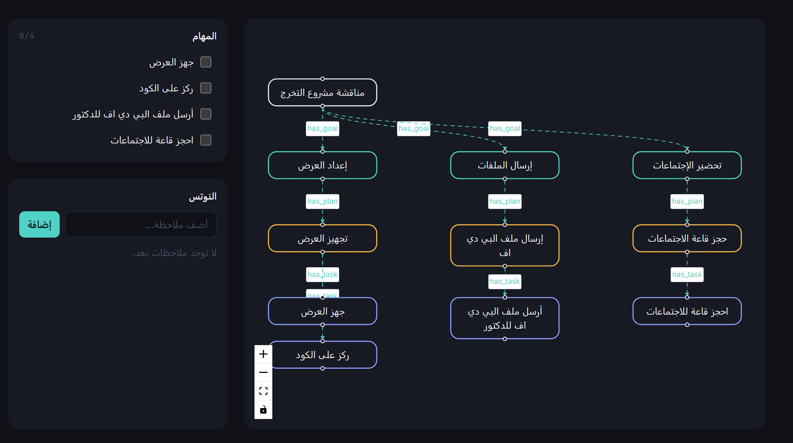

# GraphMyVoice — Audio to Mind Map

Transform any audio lecture into a structured, interactive mind map — automatically.

GraphMyVoice is an AI-powered learning assistant that takes a recorded audio file (lecture, meeting, voice note) and converts it into a fully interactive mind map with extracted goals, plans, tasks, and notes.

---

## The Problem We Solved

Students and professionals often sit through long lectures or meetings and struggle to organize the information afterward. Manual note-taking is slow and incomplete, and existing tools require you to type everything manually.

Our solution: Just upload an audio file. GraphMyVoice handles the rest:

1. Transcribes the audio using Groq Whisper (fast, free, accurate)
2. Validates the transcript quality with pre/post guardrails
3. Extracts goals, plans, and tasks using a Llama LLM
4. Builds an interactive mind map you can explore, annotate, and act on

---

## How It Works



---

## System Architecture

```
Browser (Next.js)
       |
       | HTTP / REST
       v
FastAPI Backend  <-->  PostgreSQL Database
       |
       | LangGraph Pipeline
       v
  Groq API (Whisper + Llama)
```

---

## Tech Stack

### Backend

| Technology | Role |
|---|---|
| FastAPI | High-performance async REST API framework |
| LangGraph | Orchestrates the multi-step AI pipeline as a stateful graph |
| Groq API | Free-tier Whisper STT (transcription) + Llama 3.3 LLM (extraction) |
| PostgreSQL 16 | Primary relational database |
| SQLAlchemy + Asyncpg | Async ORM and database driver |
| Alembic | Database schema migrations |
| Structlog | Structured logging across all pipeline nodes |
| Docker + Docker Compose | Containerized deployment for backend and database |

### Frontend

| Technology | Role |
|---|---|
| Next.js 16 | React framework with file-based routing |
| React Flow | Interactive node-based mind map visualization |
| TypeScript | Type-safe frontend code |
| Vanilla CSS | Custom design system with dark mode |

---

## Project Structure

```
GraphMyVoice/
|
+-- backend/
|   |
|   +-- app/
|   |   +-- agents/
|   |   |   +-- graph.py                  # LangGraph pipeline definition
|   |   |   +-- state.py                  # Shared GraphState TypedDict
|   |   |   +-- nodes/
|   |   |   |   +-- ingestion.py          # File validation node
|   |   |   |   +-- transcription.py      # Groq Whisper STT node
|   |   |   |   +-- guardrail_pre.py      # Transcript quality check node
|   |   |   |   +-- extraction.py         # Groq Llama extraction node
|   |   |   |   +-- mindmap_builder.py    # Build nodes and edges node
|   |   |   |   +-- guardrail_post.py     # Hallucination check node
|   |   |   |   +-- persistence.py        # Save to PostgreSQL node
|   |   |   +-- prompts/
|   |   |       +-- extraction_prompt.py  # LLM system and user prompts
|   |   +-- api/
|   |   |   +-- v1/
|   |   |       +-- sessions.py           # Upload, status, list endpoints
|   |   |       +-- notes.py              # Notes CRUD endpoints
|   |   |       +-- tasks.py              # Tasks CRUD endpoints
|   |   +-- models/
|   |   |   +-- session.py               # Session ORM model
|   |   |   +-- mindmap_node.py          # MindmapNode ORM model
|   |   |   +-- mindmap_edge.py          # MindmapEdge ORM model
|   |   |   +-- note.py                  # Note ORM model
|   |   |   +-- task.py                  # Task ORM model
|   |   +-- services/
|   |   |   +-- pipeline_service.py      # Background task runner
|   |   +-- config.py                    # Pydantic settings
|   |   +-- database.py                  # AsyncSession factory
|   |   +-- main.py                      # FastAPI app entrypoint
|   +-- migrations/                      # Alembic migration versions
|   +-- docker-compose.yml               # PostgreSQL + Backend containers
|   +-- Dockerfile
|   +-- requirements.txt
|   +-- .env.example
|
+-- frontend/
|   |
|   +-- app/
|   |   +-- page.tsx                     # Upload page (home)
|   |   +-- session/[id]/page.tsx        # Session workspace (progress > mindmap)
|   |   +-- layout.tsx
|   |   +-- globals.css
|   +-- components/
|   |   +-- MindMap.tsx                  # React Flow mind map
|   |   +-- UploadPanel.tsx              # Audio file upload UI
|   |   +-- ProgressTimeline.tsx         # Pipeline progress display
|   |   +-- TaskList.tsx                 # Extracted tasks with checkboxes
|   |   +-- NotesPanel.tsx               # Session notes
|   +-- lib/
|   |   +-- api.ts                       # REST API client and polling
|   |   +-- types.ts                     # TypeScript type definitions
|   +-- .env.local                       # Frontend env (API base URL)
|   +-- package.json
|
+-- README.md
```

---

## Quick Start (Docker — Recommended)

### Prerequisites

- [Docker Desktop](https://www.docker.com/products/docker-desktop/) installed and running
- A free [Groq API Key](https://console.groq.com) (no credit card required)
- [Node.js 18+](https://nodejs.org) for the frontend

### Step 1 — Clone the repo

```bash
git clone <your-repo-url>
cd GraphMyVoice
```

### Step 2 — Configure the backend

```bash
cp backend/.env.example backend/.env
```

Open `backend/.env` and fill in your Groq API key:

```env
GROQ_API_KEY=your_groq_api_key_here
JWT_SECRET=change-me
```

### Step 3 — Start backend and database

```bash
cd backend
docker-compose up --build -d
```

This will automatically:
- Start a PostgreSQL 16 database on port 5433
- Run Alembic migrations
- Start the FastAPI backend on http://localhost:8000

### Step 4 — Start the frontend

Open a new terminal:

```bash
cd frontend
npm install
npm run dev
```

The app will be available at http://localhost:3000

### Step 5 — Upload an audio file

1. Open http://localhost:3000
2. Click "Choose File" and select an audio file (.mp3, .wav, .m4a, .webm)
3. Watch the pipeline progress in real-time
4. Explore your generated mind map

---

## Bugs Fixed During Development

| # | Error | Root Cause | Fix |
|---|---|---|---|
| 1 | `failed to fetch` | Backend container crashing on startup | Alembic was not reading DATABASE_URL from env — fixed migrations/env.py to load from os.environ |
| 2 | `401 Authorization header missing` | JWT bypass not triggering | docker restart does not re-read .env — needed --force-recreate to reload env vars |
| 3 | `400 /sessions/undefined/status` | Session ID was undefined | Next.js 15 changed params to a Promise — fixed by wrapping with React.use() |
| 4 | `invalid input value for enum: "queued"` | Pipeline status did not match DB enum | Mapped all node statuses to valid DB enum values |
| 5 | `404 gemini-1.5-flash not found` | Hardcoded deprecated model name | Replaced hardcoded model with configurable settings.llm_model |
| 6 | `429 RESOURCE_EXHAUSTED` | Gemini free tier quota exhausted | Migrated entire AI stack to Groq (free, no credit card needed) |
| 7 | `Pipeline crashed: 'node_type'` | Field name mismatch in state dict | guardrail_post.py used node_type but MindmapNodeDict defines it as type |

---

## Output Screenshots


| Upload Screen | Processing Pipeline | Generated Mind Map |
|:---:|:---:|:---:|
|  |  |  |

To add screenshots: Create a `screenshots/` folder in the project root and place your images there.

---

## Team

| Role | Name |
|---|---|
| Frontend Developer | <!-- Mohammed Alfarraj --> |
| Backend Developer | <!-- sultan Abuthnain --> |
| Course / Bootcamp | <!-- SDAIA Academy --> |

---

## License

This project was built as a capstone project. All rights reserved to the team members listed above.
